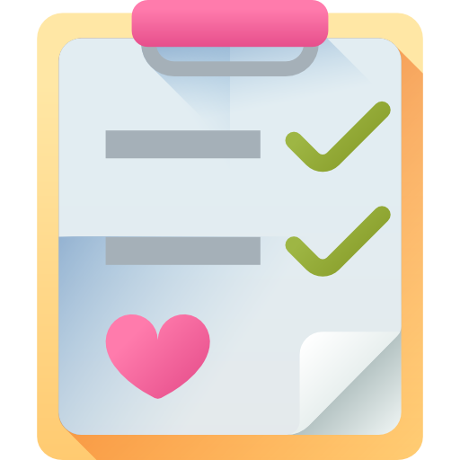

<a href="https://github.com/vuejs/vue"></a>
<a href="https://github.com/laravel/laravel"></a>
<a href="https://github.com/microsoftarchive/redis"></a>


<h1>		Medcheck</h1>

**Medcheck**は主に健康診断の現場で行う業務処理をシステム化することでペーパーレス化と効率向上を図る目的で開発しました。


## 概要

このシステムは、以前開発した[バーコード受付処理ツール](https://github.com/bluewhale1020/BarcodeReceptionAssistant)を、社内の要望を受けて健診の結果管理や進捗管理など必要な機能を追加してウェブシステムとしてまとめたものです。通常の健診の他、特殊健診に対応するため、有機溶剤や特定化学物質取扱者健診用に、肺活量や握力、尿代謝物などを検査項目に含めています。


## 機能一覧

+ ログイン認証

+ 権限によるアクセス制限

+ 健診簿のインポート
  + 健診簿ファイルをドラッグドロップでテーブルにデータ表示
  + テーブルデータの簡易編集
  + システムにアップロード
  
+ 受診者の受付処理のための、予約リスト管理ページ
  + 受診票のバーコードでの受付処理
  + 予約の新規作成・編集・削除
  + 健診簿データの出力
  
+ 検査進捗管理ページ

+ 健診結果の出力ページ

+ 検査エリアの作成・管理

+ 検査エリアの対象者リストページ
  + 設定した検査エリアごとに、対象者を一覧表示
  + そのエリアの検査結果を入力（正常範囲外の時のアラート表示）
  
+ 各種統計データ

  + 受診状況のグラフ表示
  + 検査エリアの進捗状況
  + システム上の実行処理をリストで表示
  
+ 連絡ボード

  + チャット機能でスタッフ同士で連絡・情報共有

  
## インストール手順（仮）

### 前段階

Medcheckでは、データのリアルタイム更新のために、Laravel Broadcastを使用しています。そのため、事前にRedisデータベースをインストールして起動する必要があります。

#### Redisのインストール

Windows向けには、公式ページではインストーラは提供されていませんので、マイクロソフトの[RedisのWindows版開発ページ](https://github.com/microsoftarchive/redis/releases)でインストーラをダウンロードしてインストールします。


### Medcheckのインストール

```bash
# このプロジェクトをウェブサーバー上にクローン
git clone https://github.com/bluewhale1020/medcheck.git

# プロジェクトのディレクトリに移動
cd medcheck

# PHPのパッケージをcomposerでインストール
composer install

# アプリケーションキーの設定
php artisan key:generate

# npmパッケージのインストール
npm install

# アセットのコンパイル
npm run dev
```


## システム設定

### DBの設定

DBサーバーを起動し、Medcheck用の適当な名前のデータベースを作成します。

### .envの設定
+ envファイルのDB設定の箇所を作成したデータベースに合わせて書き換えてください。
+ BROADCAST_DRIVERを`redis`に変更します。

### マイグレーション

```bash
# マイグレーションの実行
php artisan migrate

# 各種設定用テーブルのデータを一括挿入（csvファイルを使う）
php artisan db:seed
```

### API認証

```bash
# passportのデプロイ
php artisan passport:keys
```


### ブロードキャスト設定

```bash
# Redis起動
redis-server.exe

# laravel-echo-serverのインストール
npm install -g laravel-echo-server

# laravel-echo-serverの初期設定
laravel-echo-server init

# laravel-echo-server起動
laravel-echo-server start

```


## 使い方

詳細についてはシステム内のマニュアルに記載


### 登録済みユーザー（マイグレーション実行後）

```
ユーザー名： admin
パスワード： password
役柄	   ： 管理者
```


### 役柄による利用制限

ユーザーの役柄により、ログイン後のメニューの表示項目が変わります。「管理者」なら全て表示されますが、
「スタッフ」なら検査エリアの一部しか表示されません。


### 健診簿サンプル

`sample/reception_list_sample.xlsx`ファイルでテストできます。


### 簡単な利用方法

1. ブラウザから`ドメイン名/medcheck/public/`か、Medcheckをインストールした場所のpublicフォルダにアクセス

2. ログイン画面

   + ユーザー名とパスワードを入力してログイン

3. システムに受診者データを一括登録する

   + 左のメニューで「健診簿インポート」を選択

   + 健診簿ファイルを選択

   + 「ファイルをインポートする」ボタンを押してデータをシステムにアップロード

4. 受診者の受付

   あらかじめ受診票には、在籍番号を表すバーコードが印刷されていて、バーコードリーダーで

   それを読み込めることが前提です。

   + 左のメニューで「予約リスト」を選択
   + バーコード欄にカーソルを置き、バーコードリーダーでバーコードを読み取る
   + 該当する受診者の予約情報フォームが表示されるので、「確定」ボタンを押して受付処理を行う
   + 受診者に通番が登録されて、該当する検査の対象者一覧に表示される

5. 各検査エリアで検査実施

   + 担当するエリアを左のメニューから選択（例　視力検査：　検査エリア／視力）
   + リスト上部の通番欄に受診者の通番を入力して、リストを絞り込む
   + 結果入力フォームを開いて、検査結果を入力

6. 健診結果を出力

   + 左のメニューで「健診結果出力」を選択
   + 結果リスト右上の「結果データ出力」ボタンを押して、結果データをエクセルファイルでダウンロードする


## 動作環境

開発したPCの環境は、以下の通りですが、ウェブシステムですので、基本的にはapache等のウェブサーバーとMysql等のＤＢサーバーが利用できる環境ならば動作可能です。

+ Windows10
+ Vue 2.6.10
+ PHP 7.2.11
+ Laravel 5.8
+ MariaDB
+ Redis 3.0.5
+ PHP拡張（openssl, pdo, mbstring, tokenizer, xml, ctype, json, gd,  zip ）


## ライセンス (License)

**Medcheck**は[MIT license](https://opensource.org/licenses/MIT)のもとで公開されています。<br />
**Medcheck** is open-source software licensed under the [MIT license](https://opensource.org/licenses/MIT).
